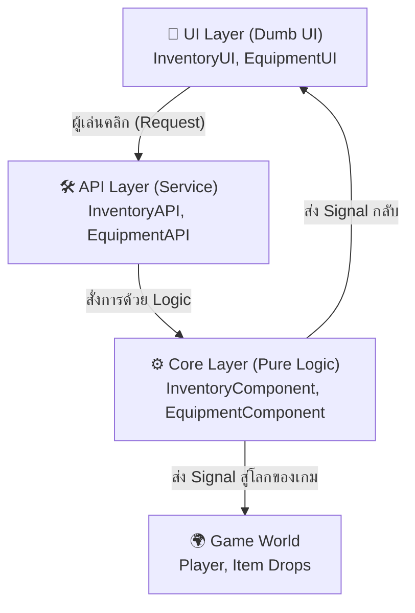
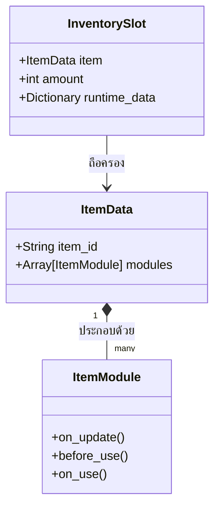

# สถาปัตยกรรม (Architecture & Philosophy)

Universal Inventory ไม่ใช่แค่ระบบจัดการกระเป๋าธรรมดา แต่มันคือ **Core Gameplay Framework** ที่ถูกออกแบบมาเพื่อรองรับเกมทุกรูปแบบ ไม่ว่าจะเป็น 2D RPG, 3D Survival, หรือ Turn-based Strategy โดยยึดมั่นในอุดมการณ์ 2 ข้อ:

1. **Engine Independence (ความเป็นอิสระจาก Engine):** ระบบ Core ทั้งหมดต้องไม่รู้จักโหนดเกม (`Node2D`/`Node3D`), ไม่ผูกติดกับคลาสผู้เล่น (`Player`), และไม่สนใจเรื่องฟิสิกส์ ทุกอย่างทำงานผ่านข้อมูล (Data) และการส่งสัญญาณ (Signals)
2. **Separation of Concerns (การแยกส่วนหน้าที่):** สถาปัตยกรรมจะถูกแบ่งเป็นชั้นๆ อย่างเด็ดขาด UI มีหน้าที่แค่ "วาดภาพ" ส่วน Core มีหน้าที่ "คำนวณ"

---

## 🏗️ โครงสร้าง 3 ชั้น (3-Tier Architecture)

ระบบถูกออกแบบให้แบ่งเป็น 3 Layer ชัดเจน เพื่อให้แก้ไขส่วนใดส่วนหนึ่งได้โดยไม่กระทบส่วนอื่น



### 1. ⚙️ Core Layer (ชั้นแกนกลาง)
ชั้นนี้เปรียบเสมือนสมองของระบบ สนใจเฉพาะคณิตศาสตร์และข้อมูล 
- **องค์ประกอบ:** `InventoryComponent`, `EquipmentComponent`, `ConditionManager`
- **ทำไมถึงสำคัญ:** เพราะมันไม่ผูกมัดกับภาพกราฟิก คุณสามารถรัน Core Layer นี้บนเซิร์ฟเวอร์แบบ Headless (สำหรับเกม Multiplayer) ได้ทันทีโดยไม่พัง

### 2. 🛠️ API Layer (ชั้นบริการ)
เนื่องจาก Core สนใจแค่ข้อมูลพื้นฐาน การให้ UI หรือตัวเกมสั่งงาน Core ตรงๆ อาจทำให้เกิดการเขียนโค้ดที่ซ้ำซ้อน เราจึงมี API Layer เป็นตัวกลาง
- **องค์ประกอบ:** `InventoryAPI`, `EquipmentAPI`
- **หน้าที่:** รวบรวมคำสั่งที่ใช้บ่อย เช่น การย้ายของ (`transfer_item`), การทิ้งของ (`drop_item`), หรือการคราฟต์ไอเทม ซึ่ง API จะไปจัดการเรียก Core ต่อให้ตามลำดับที่ถูกต้อง

### 3. 🎨 UI Layer (ชั้นแสดงผล)
- **คอนเซปต์ "Dumb UI":** UI ของเราต้องโง่ที่สุดเท่าที่จะทำได้ มันจะไม่มีวันเรียกใช้คำสั่ง `inventory.slots[0] = ...` ด้วยตัวเองเด็ดขาด
- **หน้าที่:** นั่งรอรับ Signal อย่างเดียว (เช่น `inventory_changed`) พอมี Signal มา มันก็จะล้างหน้าจอและวาดใหม่ตามข้อมูลที่ Core ส่งมาให้

---

## 📦 Data Model (โมเดลข้อมูล)

ไอเทมในเกมทั่วไปมักเขียนลอจิกฝังไว้ในตัวไอเทม (เช่น คลาส `Potion` แตกต่างจากคลาส `Sword`) แต่เราใช้แนวทาง **Data-Driven & Composition**



- **`ItemData` (Resource):** เป็นเพียงแม่พิมพ์ (Blueprint) เก็บแค่ชื่อ รูปภาพ และรายชื่อ `ItemModule` (ชิ้นส่วนความสามารถ)
- **`ItemModule`:** เป็นชิ้นส่วนลอจิก เช่น `FoodModule`, `WeaponModule` ไอเทม 1 ชิ้นสามารถมีกี่โมดูลก็ได้ (เช่น ดาบที่กินได้)
- **`runtime_data` (Dictionary):** ตัวแปรสำคัญที่สุด! เนื่องจาก `ItemData` เป็น Resource (ใช้ข้อมูลร่วมกันทั้งเกม) เราจึงไม่สามารถแก้ค่า `durability` หรือ `freshness` ใน `ItemData` ได้ เราจึงเอาข้อมูลที่ต้องเปลี่ยนแปลงแบบ Real-time มาฝากไว้ที่ `runtime_data` ของ `InventorySlot` แทน

---

## 🛡️ นโยบายสลายความขัดแย้งของโมดูล (Module Resolution Policy)

เมื่อคุณอนุญาตให้ประกอบโมดูลได้อย่างอิสระ (เช่น ใส่ `WeaponModule` 2 อันในไอเทมชิ้นเดียว) ย่อมเกิดปัญหาว่า "ลอจิกของใครจะชนะ?" ระบบจึงมีกฎเหล็ก 3 ข้อ:

1. **นโยบายยับยั้ง (Veto Policy) สำหรับ `before_use`:** 
   - หากมีโมดูลใดโมดูลหนึ่งคืนค่า `prevented: true` ออกมา การกระทำนั้นจะถูกระงับทันที และหยุดรันโมดูลที่เหลือ (Short-circuit)
   - *ตัวอย่าง:* ดาบที่มีเวทมนตร์ล็อกไว้ แม้จะกดใช้ แต่โมดูลเวทมนตร์คืนค่า Veto ดาบนั้นก็จะใช้ไม่ได้
2. **นโยบายทบยอด (Accumulation Policy) สำหรับ `on_use`:**
   - เมื่อกดใช้สำเร็จ ผลลัพธ์ (Payload) จากทุกโมดูลจะถูกนำมารวมกันเป็น Array และโยนกลับไปให้เกม
   - *ตัวอย่าง:* ไอเทมที่มีทั้ง `FoodModule` (เพิ่ม HP) และ `PoisonModule` (ลด HP) เกมจะได้รับ Payload ทั้งคู่ไปประมวลผลพร้อมกัน
3. **นโยบายเขียนทับตามลำดับ (Sequential Override) สำหรับ `on_update`:**
   - หาก 2 โมดูลพยายามเขียนข้อมูลลง `runtime_data` ที่คีย์ (Key) เดียวกัน โมดูลที่อยู่ **ด้านล่างสุด (ดัชนีสุดท้าย)** ในอาร์เรย์จะเป็นผู้ชนะเสมอ

*(หมายเหตุ: ระบบมีฟังก์ชัน `validate_modules()` คอยแจ้งเตือนผ่าน Console หากพบการใส่โมดูลซ้ำซ้อนกัน)*

---

## 🧪 ระบบผสมผสานและปฏิกิริยา (Crafting & Reactions)

จุดเด่นที่สุดของ Universal Inventory คือการแยกโดเมนระหว่าง **"การประดิษฐ์สิ่งของ"** และ **"ปฏิกิริยาทางเคมี"** ออกจากกันอย่างเด็ดขาด คล้ายกับเกม RPG ฟอร์มยักษ์ระดับโลก

```mermaid
graph LR
    subgraph 🛠️ Item Crafting (Inventory Domain)
        ItemA[ItemData: Wood]
        ItemB[ItemData: Stone]
        Recipe[ItemRecipe]
        ItemA & ItemB --> Recipe
        Recipe --> Result[ItemData: Axe]
    end

    subgraph 💥 Condition Reaction (Character Domain)
        CondA[Condition: Wet]
        CondB[Condition: Burning]
        Reaction[ConditionReaction]
        CondA & CondB --> Reaction
        Reaction --> ResultCond[Condition: Steam]
    end
```

### 1. โดเมนกระเป๋า (Item Crafting System)
- **แนวคิด:** `ItemData + ItemData = ItemData`
- ใช้ Resource กลางชื่อ `RecipeRegistry` เพื่อเก็บรวบรวม `ItemRecipe` ทั้งหมดในเกม
- จัดการผ่าน `InventoryAPI.craft_items` 
- **ความพิเศษ:** ระบบนี้ทำงานเฉพาะในกระเป๋า ไม่เกี่ยวกับตัวละคร หักไอเทมและเสกไอเทมผลลัพธ์ลงกระเป๋าตามสูตรผสม (และมี Priority เพื่อแก้ปัญหาเวลามีสูตรทับซ้อนกัน)

### 2. โดเมนตัวละคร (Condition Reaction System)
- **แนวคิด:** `Condition + Condition = New Condition` (ระบบปฏิกิริยาธาตุ)
- ขับเคลื่อนผ่าน `ConditionManager` ที่ติดอยู่บนตัวละคร (ไม่ใช่ในกระเป๋า)
- อ้างอิงจาก `ReactionRegistry`
- **ความพิเศษ:** ระบบจะทำงานแบบ Real-time ทันทีที่ตัวละครได้รับสถานะ "Burning" ระบบจะเช็คว่าในตัวมีสถานะ "Wet" หรือไม่ ถ้ามี จะสั่งระงับ (Consume) สถานะทั้งสอง และมอบสถานะใหม่ "Steam" (ควันพรางตัว) ให้ทันที ซึ่งปลดล็อกเกมเพลย์ระดับลึกได้อย่างง่ายดาย
